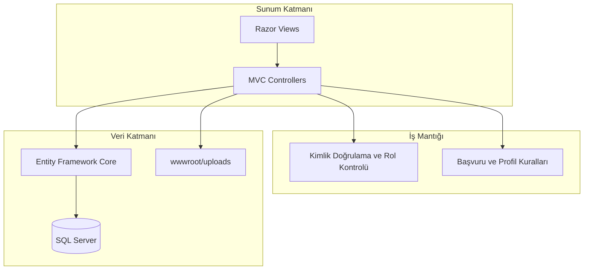

# Analiz ve Tasarım Belgesi
## Burs Takip Sistemi (BURSTAR)

| Alan | Değer |
|------|--------|
| Proje adı | Burs Takip Sistemi (BURSTAR) |
| Mimari | Katmanlı web uygulaması (MVC) |
| Teknoloji | ASP.NET Core 10, Entity Framework Core, Microsoft SQL Server |
| Belge türü | Analiz ve Tasarım Belgesi (ATB) |
| Tarih | Mayıs 2026 |

---

## 1. Projenin Amacı ve Kapsamı

Burs Takip Sistemi (BURSTAR), burs veren kurumlar ile burs arayan öğrenciler arasındaki süreci dijital ortamda yönetmeyi amaçlayan web tabanlı bir bilgi sistemidir. Sistem; aktif burs ilanlarının merkezi bir vitrinde listelenmesi, öğrencilerin profil ve belge bilgileriyle başvuru yapması, kurumların ilan oluşturup gelen başvuruları değerlendirmesi ve sistem yöneticisinin genel istatistikleri izlemesi gibi temel işlevleri tek platformda birleştirir.

Proje kapsamı; kullanıcı kaydı ve oturum yönetimi, öğrenci ve kurum profillerinin tutulması, burs programı tanımlama, başvuru oluşturma ve durum güncelleme, belge yükleme ile yönetici paneli özet raporlamasını içerir. Kapsam dışında bırakılan veya veri modelinde hazırlanmış ancak uygulamada henüz tam işletilmeyen alanlar (örneğin burs ilanının yönetici onay akışı, `SystemLog` tabanlı denetim kaydı, başvuruya özel belge eşlemesi) gelecek sürümlerde genişletilebilecek tasarım rezervleridir. Sistem akademik bir yazılım mühendisliği projesi olarak geliştirilmiş olup, gerçek kurumsal entegrasyonlar (e-Devlet, banka API'leri, e-imza) bu belge kapsamında ele alınmamaktadır.

---

## 2. İşlevsel Gereksinimler

Gereksinimler, sistemde tanımlı üç rol üzerinden (`student`, `institution`, `admin`) gruplandırılmıştır.

### 2.1. Genel ve Ziyaretçi İşlevleri

| ID | Gereksinim |
|----|------------|
| FR-01 | Ziyaretçi ve oturum açmış kullanıcılar, durumu **Aktif** ve son başvuru tarihi geçmemiş burs ilanlarını ana sayfada listeleyebilir. |
| FR-02 | Kullanıcı, herhangi bir burs ilanının detay sayfasını (kurum adı, tutar, süre, kriterler, son tarihler) görüntüleyebilir. |
| FR-03 | Yeni kullanıcı, e-posta, şifre ve rol seçimi (`student` veya `institution`) ile kayıt olabilir. |
| FR-04 | Kayıtlı kullanıcı, e-posta ve şifre ile oturum açabilir ve oturumu kapatabilir. |

### 2.2. Öğrenci (Student) İşlevleri

| ID | Gereksinim |
|----|------------|
| FR-10 | Öğrenci, ad-soyad, doğum tarihi, cinsiyet, bölüm, okul, telefon, IBAN vb. bilgileri içeren profilini oluşturabilir ve güncelleyebilir. |
| FR-11 | Öğrenci, transkript, öğrenci belgesi, kimlik vb. türlerde belge yükleyebilir ve yüklediği belgeleri listeleyebilir. |
| FR-12 | Profil ve en az bir belge tamamlanmış öğrenci, aktif bir burs programına **tek seferlik** başvuru yapabilir. |
| FR-13 | Öğrenci, yaptığı tüm başvuruları burs ve kurum bilgileriyle birlikte "Başvurularım" ekranında takip edebilir. |
| FR-14 | Aynı programa tekrar başvuru yapılması sistem tarafından engellenir. |

### 2.3. Kurum (Institution) İşlevleri

| ID | Gereksinim |
|----|------------|
| FR-20 | Kurum, kurum adı, tüzel tip, kimlik/vergi numarası ve yetkili kişi iletişim bilgilerinden oluşan profilini oluşturabilir ve güncelleyebilir. |
| FR-21 | Profili tanımlı kurum, burs programı oluşturabilir (program adı, aylık tutar, süre, kontenjan, cinsiyet/bölüm/not kriterleri, başvuru ve teslim tarihleri). |
| FR-22 | Kurum, yalnızca kendi oluşturduğu burs ilanlarını listeleyebilir ve silebilir (ilana bağlı başvurular da silinir). |
| FR-23 | Kurum, bir burs programına gelen **Beklemede** durumundaki başvuruları ve başvuran öğrencilerin yüklediği belgeleri görüntüleyebilir. |
| FR-24 | Kurum, başvuruyu onaylayabilir veya reddedebilir; karara ilişkin kurum notu ekleyebilir. |
| FR-25 | Kurum kullanıcıları, öğrenci gibi burs başvurusu yapamaz (arayüz ve iş kuralları ile kısıtlıdır). |

### 2.4. Yönetici (Admin) İşlevleri

| ID | Gereksinim |
|----|------------|
| FR-30 | Yönetici, yalnızca `admin` rolü ile kimlik doğrulaması sonrası yönetici paneline erişebilir. |
| FR-31 | Yönetici; toplam kullanıcı, öğrenci, kurum, burs programı ve başvuru sayılarını gösteren özet gösterge panelini görüntüleyebilir. |
| FR-32 | Yönetici, son kayıt olan kullanıcıları ve rol dağılımlarını listeleyebilir (kullanıcı yönetimi ekranı). |

### 2.5. Veri ve İş Kuralları (Özet)

- Burs ilanı oluşturulduğunda varsayılan durum **Aktif** olarak atanır.
- Başvuru ilk kayıtta durumu **Beklemede** olur; kurum değerlendirmesi sonrası **Onaylandı** veya **Reddedildi** olarak güncellenir.
- Veritabanında yabancı anahtarlar için otomatik silme (cascade) devre dışı bırakılmıştır; veri bütünlüğü korunur.

---

## 3. İşlevsel Olmayan Gereksinimler

### 3.1. Performans ve Ölçeklenebilirlik

| ID | Gereksinim |
|----|------------|
| NFR-01 | Veritabanı sorguları için komut zaman aşımı 180 saniye ile yapılandırılmıştır (uzun süren toplu işlemlere tolerans). |
| NFR-02 | Ana sayfa ve listeleme ekranları, Entity Framework `Include` ile ilişkili verilerin tek sorguda yüklenmesini hedefler. |
| NFR-03 | Yüklenen belgeler benzersiz dosya adı (GUID öneki) ile saklanarak çakışma riski azaltılır. |

### 3.2. Güvenlik

| ID | Gereksinim |
|----|------------|
| NFR-10 | Kimlik doğrulama, çerez tabanlı oturum yönetimi ile sağlanır; oturum süresi 7 gündür. |
| NFR-11 | Parolalar düz metin olarak saklanmaz; SHA-256 ile özetlenerek kaydedilir. |
| NFR-12 | Controller düzeyinde `[Authorize(Roles = "...")]` ile rol tabanlı erişim kontrolü uygulanır. |
| NFR-13 | Kurum, yalnızca kendi kurum kimliğine bağlı burs ve başvurular üzerinde işlem yapabilir (sahiplik kontrolü). |
| NFR-14 | Üretim ortamında HTTPS yönlendirmesi ve HSTS etkinleştirilir. |
| NFR-15 | Bağlantı dizesi ve hassas yapılandırmalar `User Secrets` / yapılandırma dosyaları üzerinden yönetilir. |

### 3.3. Kullanılabilirlik ve Erişilebilirlik

| ID | Gereksinim |
|----|------------|
| NFR-20 | Arayüz Türkçe dilindedir; Bootstrap 5 tabanlı duyarlı (responsive) tasarım kullanılır. |
| NFR-21 | İşlem sonuçları `TempData` ve `ViewBag` ile kullanıcıya geri bildirim olarak sunulur (başarı/hata mesajları). |

### 3.4. Güvenilirlik ve Bakım

| ID | Gereksinim |
|----|------------|
| NFR-30 | Geliştirme dışı ortamda merkezi hata sayfası (`/Home/Error`) devreye girer. |
| NFR-31 | Veri erişimi Entity Framework Core Code First ve migration altyapısı ile sürümlenir. |
| NFR-32 | Ondalık alanlar için `en-US` kültür formatı kullanılarak form–veritabanı uyumsuzlukları önlenir. |

### 3.5. Taşınabilirlik ve Dağıtım

| ID | Gereksinim |
|----|------------|
| NFR-40 | Uygulama .NET 10 hedef çerçevesi ile platform bağımsız çalıştırılabilir. |
| NFR-41 | Kalıcı veri Microsoft SQL Server üzerinde tutulur; statik dosyalar `wwwroot` altında sunulur. |

---

## 4. Temel Kullanım Senaryoları (Use Cases)

### 4.1. Aktörler

| Aktör | Açıklama |
|--------|----------|
| **Ziyaretçi** | Oturum açmamış kullanıcı |
| **Öğrenci** | `student` rolüne sahip kullanıcı |
| **Kurum** | `institution` rolüne sahip burs veren kurum temsilcisi |
| **Yönetici** | `admin` rolüne sahip sistem yöneticisi |

---

### UC-01: Öğrencinin Bursa Başvurması (Kullanıcı Senaryosu)

**Ön koşullar:** Öğrenci kayıtlı ve oturum açmış; profil tamamlanmış; en az bir belge yüklenmiş; hedef burs **Aktif** ve son başvuru tarihi geçmemiş; öğrenci aynı programa daha önce başvurmamış.

| Adım | Aktör | Sistem davranışı |
|------|--------|------------------|
| 1 | Öğrenci | Ana sayfada aktif burs ilanlarını inceler. |
| 2 | Öğrenci | İlgili ilan için "Detayları Gör ve Başvur" bağlantısına tıklar. |
| 3 | Sistem | Burs detay sayfasını (kurum, tutar, kriterler, tarihler) gösterir. |
| 4 | Öğrenci | "Başvur" işlemini tetikler. |
| 5 | Sistem | Profil ve belge kontrollerini yapar; koşullar sağlanıyorsa başvuruyu **Beklemede** durumunda kaydeder. |
| 6 | Sistem | Öğrenciyi "Başvurularım" sayfasına yönlendirir ve başarı mesajı gösterir. |

**Alternatif akışlar:**

- **5a** Profil eksik → "Öğrenci Panelim"e yönlendirme ve hata mesajı.
- **5b** Belge yok → Belgeler sayfasına yönlendirme talebi ve hata mesajı.
- **5c** Daha önce başvurulmuş → Aynı detay sayfasında "zaten başvurdunuz" uyarısı.

**Son koşul:** Başvuru kaydı oluşturulmuş ve kurum değerlendirmesine hazır hale gelmiştir.

---

### UC-02: Kurumun Burs İlanı Oluşturması ve Başvuru Değerlendirmesi (Kullanıcı Senaryosu)

**Ön koşullar:** Kurum kayıtlı, oturum açmış ve kurum profili tanımlı.

#### Bölüm A — İlan oluşturma

| Adım | Aktör | Sistem davranışı |
|------|--------|------------------|
| 1 | Kurum | Kurum panelinden profil bilgilerini kaydeder/günceller. |
| 2 | Kurum | Burs ilanları listesine gider ve "Yeni İlan" formunu açar. |
| 3 | Kurum | Program adı, tutar, süre, kontenjan, kriterler ve tarihleri girer. |
| 4 | Sistem | İlanı kurum kimliği ile ilişkilendirir, durumu **Aktif** yapar ve veritabanına kaydeder. |
| 5 | Sistem | İlanı ana sayfa vitrininde (tarih koşulu sağlanıyorsa) görünür kılar. |

#### Bölüm B — Başvuru değerlendirme

| Adım | Aktör | Sistem davranışı |
|------|--------|------------------|
| 6 | Kurum | Kendi ilanı için "Başvurular" ekranını açar. |
| 7 | Sistem | **Beklemede** başvuruları ve öğrenci belgelerini listeler. |
| 8 | Kurum | Başvuruyu inceleyerek onay veya red seçer; isteğe bağlı not girer. |
| 9 | Sistem | Başvuru durumunu ve `UpdatedAt` alanını günceller. |

**Son koşul:** Başvuru durumu **Onaylandı** veya **Reddedildi** olur; öğrenci "Başvurularım" ekranından sonucu görebilir.

---

### UC-03: Yönetici Paneli ve Sistem İzleme (Admin Senaryosu)

**Ön koşullar:** Kullanıcı `admin` rolü ile oturum açmıştır.

| Adım | Aktör | Sistem davranışı |
|------|--------|------------------|
| 1 | Yönetici | "Admin Paneli" menüsüne tıklar. |
| 2 | Sistem | Rol kontrolü yapar; yetkisiz erişimde giriş veya erişim reddedildi sayfasına yönlendirir. |
| 3 | Sistem | Toplam kullanıcı, öğrenci, kurum, burs ve başvuru sayılarını hesaplar. |
| 4 | Sistem | Son kayıt olan kullanıcıları rol rozetleriyle dashboard'da gösterir. |
| 5 | Yönetici | (İsteğe bağlı) Kullanıcı yönetimi ekranına geçerek tüm kullanıcı listesini inceler. |

**Son koşul:** Yönetici sistem genelindeki hacim ve kullanıcı dağılımı hakkında güncel özet bilgiye sahiptir.

---

### UC-04: Kullanıcı Kaydı ve Oturum Açma (Ortak Senaryo)

| Adım | Aktör | Sistem davranışı |
|------|--------|------------------|
| 1 | Kullanıcı | "Kayıt Ol" formunda e-posta, şifre ve rol (`student` / `institution`) girer. |
| 2 | Sistem | E-posta benzersizliğini kontrol eder; parolayı hash'leyerek kullanıcıyı kaydeder. |
| 3 | Kullanıcı | "Giriş Yap" ekranında kimlik bilgilerini girer. |
| 4 | Sistem | Kimlik bilgilerini doğrular; `UserID`, e-posta ve rol bilgisini içeren kimlik çerezi oluşturur. |
| 5 | Sistem | Rolüne uygun menü öğelerini (öğrenci paneli, kurum paneli veya admin paneli) gösterir. |

---

## 5. Sistem Mimarisi Özeti (Tasarım)

Aşağıdaki şema, belgede tanımlanan ana iş akışlarının mimari karşılığını özetler:

**Temel varlıklar:** `User`, `StudentProfile`, `InstitutionProfile`, `ScholarshipProgram`, `Application`, `Document`, `ApplicationDocument` (model), `SystemLog` (model).

---

## 6. Sonuç

Bu belge, Burs Takip Sistemi'nin akademik proje bağlamında işlevsel ve işlevsel olmayan gereksinimlerini ile temel kullanım senaryolarını resmi bir dille tanımlamaktadır. Gereksinimler mevcut uygulama davranışına dayanmaktadır; veri modelinde tanımlı fakat henüz tam işletilmeyen özellikler (yönetici onaylı ilan akışı, merkezi loglama) ilerideki iterasyonlar için genişletme alanı olarak değerlendirilmelidir.
