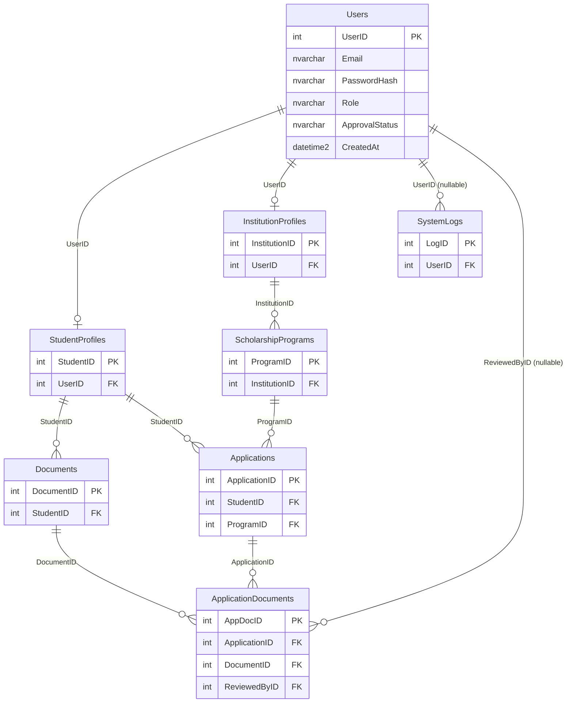

# Veritabanı Tasarım ve Kurulum Belgesi
## Burs Takip Sistemi (BURSTAR)

| Alan | Değer |
|------|--------|
| Veritabanı yönetim sistemi | Microsoft SQL Server |
| ORM | Entity Framework Core 10 (Code First) |
| Bağlam sınıfı | `ApplicationDbContext` |
| İlk migration | `20260512173712_InitialCreate` |
| Tarih | Mayıs 2026 |

---

## 1. Genel Bakış

BURSTAR uygulaması, kalıcı veriyi **Microsoft SQL Server** üzerinde tutar. Veri erişimi **Entity Framework Core** ile `ApplicationDbContext` aracılığıyla yapılır; şema değişiklikleri **Code First migration** dosyaları ile sürümlenir.

Tüm yabancı anahtar ilişkilerinde silme davranışı **`Restrict`** (T-SQL karşılığı: `ON DELETE NO ACTION`) olarak yapılandırılmıştır. Böylece üst kayıt silindiğinde bağlı alt kayıtlar otomatik silinmez; veri bütünlüğü korunur.

---

## 2. Bağlantı ve Kurulum

### 2.1. Connection String

Bağlantı bilgisi `appsettings.json` içindeki `ConnectionStrings:DefaultConnection` anahtarından okunur:

```json
"ConnectionStrings": {
  "DefaultConnection": "Server=...;Initial Catalog=BursDb;User ID=...;Password=...;Encrypt=True;..."
}
```

`Program.cs` içinde kayıt:

```csharp
builder.Services.AddDbContext<ApplicationDbContext>(options =>
    options.UseSqlServer(
        builder.Configuration.GetConnectionString("DefaultConnection"),
        sqlServerOptions => sqlServerOptions.CommandTimeout(180)));
```

**Not:** Üretim ve geliştirme ortamlarında parola gibi hassas bilgiler `User Secrets` veya ortam değişkenleri ile yönetilmelidir; depoya gerçek şifre commit edilmemelidir.

### 2.2. Entity Framework ile Kurulum (Önerilen)

Proje klasöründe:

```bash
dotnet ef database update
```

Bu komut migration dosyasını uygular ve tabloları oluşturur. Ek olarak `__EFMigrationsHistory` tablosu oluşur.

### 2.3. Manuel T-SQL ile Kurulum

Hocaya sunumda şemayı sıfırdan göstermek için `docs/sql/01_CreateSchema.sql` dosyasındaki script kullanılabilir (bu belgenin 6. bölümünde özetlenmiştir).

---

## 3. Tabloların Listesi ve Görevleri

| Tablo | C# Model | Görev |
|-------|----------|--------|
| **Users** | `User` | Sistem kullanıcıları (e-posta, şifre özeti, rol, onay durumu) |
| **StudentProfiles** | `StudentProfile` | Öğrenci rolündeki kullanıcıların kişisel ve akademik profil bilgileri |
| **InstitutionProfiles** | `InstitutionProfile` | Kurum rolündeki kullanıcıların kurumsal ve yetkili kişi bilgileri |
| **ScholarshipPrograms** | `ScholarshipProgram` | Kurumların yayınladığı burs programı / ilan kayıtları |
| **Applications** | `Application` | Öğrencinin bir burs programına yaptığı başvuru ve durumu |
| **Documents** | `Document` | Öğrencinin sisteme yüklediği belgeler (dosya yolu, tür) |
| **ApplicationDocuments** | `ApplicationDocument` | Başvuruya bağlanan belgelerin inceleme durumu (çoka-çok köprü tablosu) |
| **SystemLogs** | `SystemLog` | Sistem olayları ve denetim kayıtları (ileride kullanım için) |

**Toplam:** 8 iş tablosu (+ isteğe bağlı `__EFMigrationsHistory`).

---

## 4. Varlık–İlişki Diyagramı



---

## 5. Tablo Detayları (Sütunlar, Tipler, İlişkiler)

### 5.1. Users

| Sütun | SQL Tipi | Null | Anahtar | Açıklama |
|-------|----------|------|---------|----------|
| UserID | `int` IDENTITY | Hayır | **PK** | Kullanıcı kimliği |
| Email | `nvarchar(max)` | Hayır | — | Giriş e-postası |
| PasswordHash | `nvarchar(max)` | Hayır | — | SHA-256 parola özeti |
| Role | `nvarchar(max)` | Hayır | — | `student` / `institution` / `admin` |
| ApprovalStatus | `nvarchar(max)` | Hayır | — | `beklemede` / `onaylandi` / `reddedildi` |
| CreatedAt | `datetime2` | Hayır | — | Kayıt tarihi |

**İlişkiler:** `StudentProfiles`, `InstitutionProfiles`, `SystemLogs`, `ApplicationDocuments` tablolarına referans veren üst tablodur.

---

### 5.2. StudentProfiles

| Sütun | SQL Tipi | Null | Anahtar | Açıklama |
|-------|----------|------|---------|----------|
| StudentID | `int` IDENTITY | Hayır | **PK** | Öğrenci profil kimliği |
| UserID | `int` | Hayır | **FK → Users.UserID** | Bağlı kullanıcı hesabı |
| FirstName | `nvarchar(max)` | Hayır | — | Ad |
| LastName | `nvarchar(max)` | Hayır | — | Soyad |
| BirthDate | `datetime2` | Hayır | — | Doğum tarihi |
| Gender | `nvarchar(max)` | Hayır | — | Cinsiyet |
| DisabilityStatus | `bit` | Hayır | — | Engellilik durumu (varsayılan: 0) |
| Department | `nvarchar(max)` | Hayır | — | Bölüm |
| School | `nvarchar(max)` | Hayır | — | Okul |
| Phone | `nvarchar(max)` | Hayır | — | Telefon |
| Address | `nvarchar(max)` | Hayır | — | Adres |
| IBAN | `nvarchar(max)` | Hayır | — | Banka IBAN |
| BankName | `nvarchar(max)` | Hayır | — | Banka adı |
| PhotoPath | `nvarchar(max)` | Hayır | — | Fotoğraf dosya yolu |

**İndeks:** `IX_StudentProfiles_UserID` (UserID)

---

### 5.3. InstitutionProfiles

| Sütun | SQL Tipi | Null | Anahtar | Açıklama |
|-------|----------|------|---------|----------|
| InstitutionID | `int` IDENTITY | Hayır | **PK** | Kurum profil kimliği |
| UserID | `int` | Hayır | **FK → Users.UserID** | Bağlı kullanıcı hesabı |
| InstitutionName | `nvarchar(max)` | Hayır | — | Kurum adı |
| EntityType | `nvarchar(max)` | Hayır | — | `kurum` / `sahis` |
| IdentityNumber | `nvarchar(max)` | Hayır | — | Vergi no veya TC kimlik no |
| TaxCertificatePath | `nvarchar(max)` | Hayır | — | Vergi levhası dosya yolu |
| AuthorizedPersonName | `nvarchar(max)` | Hayır | — | Yetkili adı |
| AuthorizedPersonPhone | `nvarchar(max)` | Hayır | — | Yetkili telefon |
| AuthorizedPersonEmail | `nvarchar(max)` | Hayır | — | Yetkili e-posta |

**İndeks:** `IX_InstitutionProfiles_UserID` (UserID)

---

### 5.4. ScholarshipPrograms

| Sütun | SQL Tipi | Null | Anahtar | Açıklama |
|-------|----------|------|---------|----------|
| ProgramID | `int` IDENTITY | Hayır | **PK** | Burs program kimliği |
| InstitutionID | `int` | Hayır | **FK → InstitutionProfiles.InstitutionID** | İlanı yayınlayan kurum |
| ProgramName | `nvarchar(max)` | Hayır | — | Program / ilan adı |
| Amount | `decimal(18,2)` | Hayır | — | Aylık burs tutarı (₺) |
| DurationMonths | `int` | Evet | — | Süre (ay) |
| Quota | `int` | Evet | — | Kontenjan |
| GenderCriteria | `nvarchar(max)` | Hayır | — | Cinsiyet kriteri |
| DepartmentCriteria | `nvarchar(max)` | Hayır | — | Bölüm kriteri |
| MinGPA | `decimal(4,2)` | Evet | — | Minimum not ortalaması |
| Status | `nvarchar(max)` | Hayır | — | `taslak` / `onay_bekliyor` / `aktif` / `kapali` / `reddedildi` (uygulamada sıklıkla **Aktif**) |
| ApplicationDeadline | `datetime2` | Hayır | — | Son başvuru tarihi |
| SubmissionDeadline | `datetime2` | Hayır | — | Belge teslim son tarihi |
| AdminNote | `nvarchar(max)` | Hayır | — | Yönetici notu |
| CreatedAt | `datetime2` | Hayır | — | Oluşturulma zamanı |
| SubmittedAt | `datetime2` | Evet | — | Kuruma gönderilme zamanı |
| ApprovedAt | `datetime2` | Evet | — | Onaylanma zamanı |

**İndeks:** `IX_ScholarshipPrograms_InstitutionID` (InstitutionID)

---

### 5.5. Applications

| Sütun | SQL Tipi | Null | Anahtar | Açıklama |
|-------|----------|------|---------|----------|
| ApplicationID | `int` IDENTITY | Hayır | **PK** | Başvuru kimliği |
| StudentID | `int` | Hayır | **FK → StudentProfiles.StudentID** | Başvuran öğrenci |
| ProgramID | `int` | Hayır | **FK → ScholarshipPrograms.ProgramID** | Hedef burs programı |
| Status | `nvarchar(max)` | Hayır | — | `beklemede` / `incelemede` / `revizyon` / `kabul` / `red` (uygulamada: **Beklemede**, **Onaylandı**, **Reddedildi**) |
| AppliedAt | `datetime2` | Hayır | — | Başvuru tarihi |
| UpdatedAt | `datetime2` | Evet | — | Son güncelleme |
| InstitutionNote | `nvarchar(max)` | Hayır | — | Kurum değerlendirme notu |

**İndeksler:** `IX_Applications_StudentID`, `IX_Applications_ProgramID`

**İş kuralı:** Aynı `(StudentID, ProgramID)` çifti için uygulama katmanında tekrar başvuru engellenir (veritabanında unique constraint tanımlı değildir).

---

### 5.6. Documents

| Sütun | SQL Tipi | Null | Anahtar | Açıklama |
|-------|----------|------|---------|----------|
| DocumentID | `int` IDENTITY | Hayır | **PK** | Belge kimliği |
| StudentID | `int` | Hayır | **FK → StudentProfiles.StudentID** | Belge sahibi öğrenci |
| DocumentType | `nvarchar(max)` | Hayır | — | `transkript` / `ogrenci_belgesi` / `kimlik` / `adli_sicil` / `nufus_ornegi` |
| FilePath | `nvarchar(max)` | Hayır | — | `wwwroot` altındaki göreli dosya yolu |
| UploadedAt | `datetime2` | Hayır | — | Yükleme zamanı |

**İndeks:** `IX_Documents_StudentID` (StudentID)

---

### 5.7. ApplicationDocuments

| Sütun | SQL Tipi | Null | Anahtar | Açıklama |
|-------|----------|------|---------|----------|
| AppDocID | `int` IDENTITY | Hayır | **PK** | Köprü kayıt kimliği |
| ApplicationID | `int` | Hayır | **FK → Applications.ApplicationID** | İlgili başvuru |
| DocumentID | `int` | Hayır | **FK → Documents.DocumentID** | İlgili belge |
| Status | `nvarchar(max)` | Hayır | — | `beklemede` / `onaylandi` / `reddedildi` |
| ReviewedAt | `datetime2` | Evet | — | İnceleme zamanı |
| ReviewedByID | `int` | Evet | **FK → Users.UserID** | İnceleyen kullanıcı (admin/kurum) |

**İndeksler:** `IX_ApplicationDocuments_ApplicationID`, `IX_ApplicationDocuments_DocumentID`, `IX_ApplicationDocuments_ReviewedByID`

**Not:** Tablo şemada mevcuttur; başvuru akışında henüz tam otomatik doldurulmayabilir.

---

### 5.8. SystemLogs

| Sütun | SQL Tipi | Null | Anahtar | Açıklama |
|-------|----------|------|---------|----------|
| LogID | `int` IDENTITY | Hayır | **PK** | Log kimliği |
| UserID | `int` | Evet | **FK → Users.UserID** | İşlemi yapan kullanıcı (anonim işlemler için NULL) |
| Action | `nvarchar(max)` | Hayır | — | Kısa işlem açıklaması |
| IPAddress | `nvarchar(max)` | Hayır | — | İstemci IP adresi |
| Timestamp | `datetime2` | Hayır | — | Olay zamanı |
| Details | `nvarchar(max)` | Hayır | — | Detaylı açıklama / hata metni |

**İndeks:** `IX_SystemLogs_UserID` (UserID)

---

## 6. Yabancı Anahtar Özeti

| FK Adı | Alt Tablo | Sütun | Üst Tablo | Üst Sütun | Silme |
|--------|-----------|-------|-----------|-----------|-------|
| FK_InstitutionProfiles_Users_UserID | InstitutionProfiles | UserID | Users | UserID | NO ACTION |
| FK_StudentProfiles_Users_UserID | StudentProfiles | UserID | Users | UserID | NO ACTION |
| FK_SystemLogs_Users_UserID | SystemLogs | UserID | Users | UserID | NO ACTION |
| FK_ScholarshipPrograms_InstitutionProfiles_InstitutionID | ScholarshipPrograms | InstitutionID | InstitutionProfiles | InstitutionID | NO ACTION |
| FK_Documents_StudentProfiles_StudentID | Documents | StudentID | StudentProfiles | StudentID | NO ACTION |
| FK_Applications_StudentProfiles_StudentID | Applications | StudentID | StudentProfiles | StudentID | NO ACTION |
| FK_Applications_ScholarshipPrograms_ProgramID | Applications | ProgramID | ScholarshipPrograms | ProgramID | NO ACTION |
| FK_ApplicationDocuments_Applications_ApplicationID | ApplicationDocuments | ApplicationID | Applications | ApplicationID | NO ACTION |
| FK_ApplicationDocuments_Documents_DocumentID | ApplicationDocuments | DocumentID | Documents | DocumentID | NO ACTION |
| FK_ApplicationDocuments_Users_ReviewedByID | ApplicationDocuments | ReviewedByID | Users | UserID | NO ACTION |

---

## 7. T-SQL Kurulum Script'i (Sunum)

Aşağıdaki script, migration `InitialCreate` ile uyumlu şemayı **sıfırdan** oluşturur. Sunum öncesi test veritabanında veya `BursDb` üzerinde çalıştırılabilir.

**Dosya yolu:** [`docs/sql/01_CreateSchema.sql`](sql/01_CreateSchema.sql)

**Kullanım sırası:**

1. SQL Server Management Studio veya Azure Data Studio ile sunucuya bağlanın.
2. Hedef veritabanını seçin veya script içindeki `USE` satırını düzenleyin.
3. Script'i çalıştırın (F5).

**Alternatif:** Entity Framework ile `dotnet ef database update` komutu aynı şemayı otomatik uygular.

---

## 8. Örnek Sorgular (Doğrulama)

```sql
-- Tablo listesi
SELECT TABLE_NAME FROM INFORMATION_SCHEMA.TABLES
WHERE TABLE_TYPE = 'BASE TABLE' AND TABLE_SCHEMA = 'dbo'
ORDER BY TABLE_NAME;

-- Aktif burs ilanları (uygulama ile aynı filtre)
SELECT p.ProgramName, i.InstitutionName, p.Amount, p.ApplicationDeadline
FROM ScholarshipPrograms p
INNER JOIN InstitutionProfiles i ON p.InstitutionID = i.InstitutionID
WHERE p.Status = N'Aktif' AND p.ApplicationDeadline >= GETDATE();
```

---

## 9. Sonuç

BURSTAR veritabanı, kullanıcı–profil–burs–başvuru–belge hiyerarşisini sekiz tabloda modeller. Şema Entity Framework Core migration'ları ile proje koduyla senkron tutulur; akademik sunumlarda manuel kurulum için `docs/sql/01_CreateSchema.sql` dosyası kullanılabilir.

**İlgili belgeler:** [Analiz ve Tasarım Belgesi](ANALIZ_VE_TASARIM_BELGESI.md)
